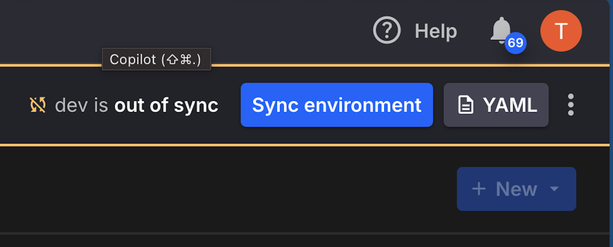
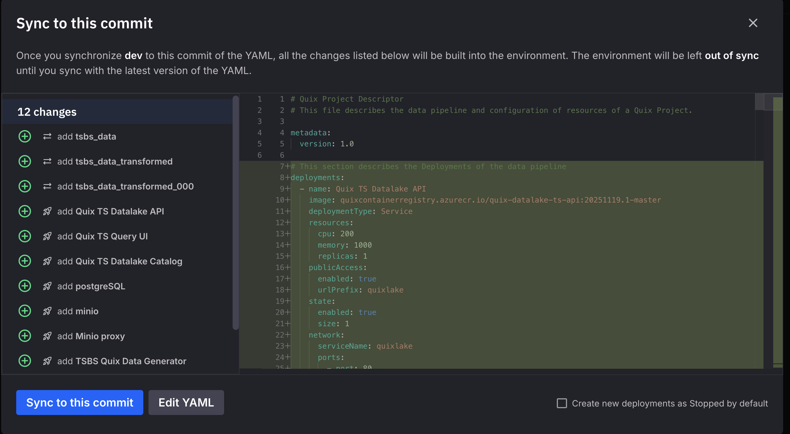

# MinIO Template Setup Guide

This guide walks you through the initial configuration of the MinIO template, including setting up secrets and verifying deployment.

## Step 1: Configure Secrets

The template requires secrets to be configured in your Quix environment. Quix manages secrets automatically during the synchronization process.

For more details on secrets management, see the [Quix Secrets Management documentation](https://quix.io/docs/deploy/secrets-management.html).

### Synchronization Flow

1. **Press the Sync button** in the top right corner of the Quix UI

   

2. **Quix will prompt you to add secrets** - enter values for any missing secrets

   

3. **Deploy the pipeline** - Quix will deploy all services with your configured secrets

   

### Required Secrets

| Secret Key | Used By | Description |
|------------|---------|-------------|
| `s3_user` | MinIO | Username for MinIO root access |
| `s3_secret` | MinIO | Password for MinIO root access |

### Setting Up Secrets

Since MinIO is deployed fresh with your environment, you define these credentials yourself:

1. **Choose a username** for `s3_user` (e.g., `admin`, `minio_admin`, etc.)
2. **Choose a strong password** for `s3_secret`

These values will be used to initialize MinIO with root credentials (`MINIO_ROOT_USER` / `MINIO_ROOT_PASSWORD`).

### Example Secret Configuration

```
s3_user:   myadminuser
s3_secret: MySecureP@ssw0rd!2024
```

> **Important:** Store these credentials securely. Once set, you cannot retrieve them from Quix - you can only overwrite them with new values.

## Step 2: Verify Deployment

After the synchronization completes, verify all services are running:

1. **Check Deployment Status** - Ensure both services start successfully:
   - MinIO
   - MinIO Proxy

2. **Verify MinIO** - Access the MinIO console through the MinIO Proxy public URL to confirm storage is working

## Troubleshooting

### Services failing to start
- Verify all secrets are configured correctly
- Check that secret names match exactly (`s3_user`, `s3_secret`)

### Cannot access MinIO
- Ensure `s3_user` and `s3_secret` secrets are set
- Check MinIO deployment logs for authentication errors
